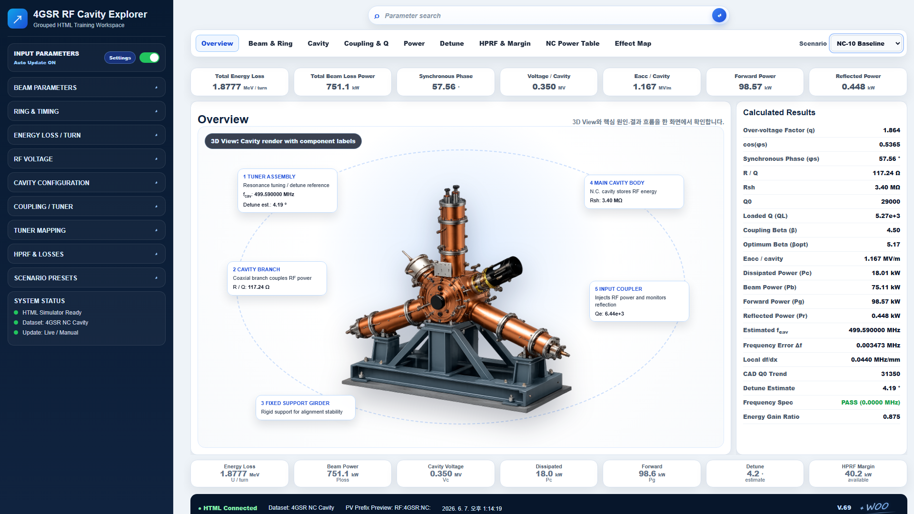

# v69 Ring & Timing Linked Calculation

## GUI screenshot

## Scope
Only Ring & Timing calculation linkage was changed.

## Formula basis
- Revolution Frequency: `f0 = c / C`
- RF Frequency: `fRF = h × f0`

where:
- `c = 299792458 m/s`
- `C` is circumference in m
- `h` is harmonic number
- `f0` and `fRF` are displayed in MHz

## Change
- `Circumference, C` is editable.
- `Harmonic Number, h` is editable.
- `Revolution Frequency, f0` is now calculated from C.
- `RF Frequency, fRF` is now calculated from h and f0.
- `RF Frequency` and `Revolution Frequency` inputs are set readonly.
- Detune-related values now use the calculated RF frequency.

## Important note
`h` does not automatically change when C changes. It is an integer design parameter. If an RF frequency must be held fixed while C changes, a separate `h = round(fRF / f0)` design mode is required and should be added explicitly.

## Calculation
No RF power budget formula was changed.
